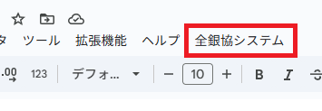

# 全銀協フォーマット対応データ作成システム ユーザーマニュアル

## 目次
1. [システム概要](#1-システム概要)
2. [事前準備](#2-事前準備)
3. [基本操作](#3-基本操作)
4. [データ入力](#4-データ入力)
5. [CSV取込処理](#5-csv取込処理)
6. [ファイル生成](#6-ファイル生成)
7. [エラー対処](#7-エラー対処)
8. [FAQ・トラブルシューティング](#8-faqトラブルシューティング)

---

## 1. システム概要

### 1.1 システムの目的
本システムは、全銀協フォーマットに準拠した振込データファイルを簡単に作成するためのツールです。Googleスプレッドシートを利用して、振込データの入力から全銀協フォーマットファイルの生成まで一貫して行えます。

### 1.2 主な機能
- **振込データ入力**: スプレッドシート上で直接データ入力
- **CSV取込**: 既存のCSVファイルからデータを一括取込
- **自動補完**: 銀行コード・支店コードから銀行名・支店名を自動設定
- **データ検証**: 入力データの妥当性を自動チェック
- **ファイル生成**: 全銀協フォーマット準拠のファイルを自動生成
- **ログ管理**: 処理履歴の記録と確認

### 1.3 動作環境
- **Googleアカウント**: 必須
- **Googleスプレッドシート**: 最新版推奨
- **ブラウザ**: Chrome、Firefox、Safari、Edge（最新版推奨）
<div style="page-break-before:always"></div>
---

## 2. 事前準備

### 2.1 全銀協システム スプレッドシートのコピー
本システムを利用するには、あらかじめ設定されたスプレッドシートをコピーして使用します。

#### 2.1.1 共有スプレッドシートへのアクセス
1. **共有リンクを開く**
   - 提供された全銀協システム テンプレートのリンクをクリック
   - Googleスプレッドシートが開きます

2. **スプレッドシートをコピー**
   - 「ファイル」メニューから「コピーを作成」をクリック
 
   - コピー先を選択：<br>
     - **マイドライブ**: 個人用のドライブに保存
     - **共有ドライブ**: 組織の共有ドライブに保存（推奨）
   - ファイル名を変更（例：「全銀協フォーマットデータ作成ツール」）
   - 「コピーを作成」ボタンをクリック
 

3. **コピー完了の確認**
   - 新しいタブでコピーされたスプレッドシートが開きます
   - タイトルバーに設定したファイル名が表示されることを確認

#### 2.1.2 システムの動作確認
スプレッドシートのコピー後、システムが正常に動作することを確認します：

1. **カスタムメニューの確認**
   - ページを再読み込み（F5キーまたはブラウザの更新ボタン）
   - メニューバーに「全銀協システム」が表示されることを確認
 

<div style="page-break-before:always"></div>

2. **シート構成の確認**
   - 以下の3つのシートが存在することを確認：
     - `振込依頼人情報` - 振込依頼人の基本情報入力シート
     - `振込データ` - 個別の振込データ入力シート
     - `金融機関マスタ` - 銀行・支店コードと名称の管理シート
 

3. **権限承認（初回のみ）**
   - 初回利用時にシステム権限の承認が必要です
   - 「全銀協システム」メニューから任意の機能を実行
   - 承認ダイアログが表示された場合：
     - 「OK」をクリックします。 
 
     - Googleアカウントを選択Googleアカウントの選択画面が表示された場合は、使用するアカウントを選択します。
 
     - 「このアプリは確認されていません」という警告が表示される場合、「詳細」をクリックします。
 
   - 「安全ではないページに移動」または「[アプリ名]に移動（安全ではありません）」をクリックします。
 
   - 必要な権限の一覧が表示されるので、チェックを入れて「続行」をクリックします。
 

<div style="page-break-before:always"></div>

#### 2.1.3 既存シートがある場合の対処
もしシートが正しく表示されない場合は、手動で初期化を実行します：

1. **シート構成の初期化**
   - 「全銀協システム」→「システム設定」→「シート構成の初期化」をクリック
 
 
   - 必要なシートが自動的に再作成されます<br>

<div style="page-break-before:always"></div>

2. **初期化完了の確認**
   - 「シート設定完了」メッセージが表示されることを確認
 
   - 各シートのヘッダーや入力検証が正しく設定されていることを確認

### 2.2 システム準備完了の確認
以下の項目をすべて確認してから実際の操作を開始してください：

#### 2.2.1 必須確認項目
- [ ] スプレッドシートのコピーが完了している
- [ ] 「全銀協システム」メニューが表示されている
- [ ] 3つのシート（振込依頼人情報、振込データ、金融機関マスタ）が存在している
- [ ] 権限承認が完了している（エラーメッセージが表示されない）

#### 2.2.2 シート詳細の確認
- **振込依頼人情報シート**: 委託者コード、委託者名等の基本情報入力欄とプルダウンメニューが設定済み（4.1.1 入力項目参照）

 

<div style="page-break-before:always"></div>

- **振込データシート**: 振込先情報入力用のヘッダー行と列幅調整済み
  <br>
- **金融機関マスタシート(任意)**: 銀行・支店コードと名称の管理用テーブル構造が設定済み
 
### 2.3 その他の初期設定
必要に応じて「全銀協システム」→「システム設定」から追加の設定を行います。

#### 2.3.1 金融機関マスタデータの準備
システムの自動補完機能を利用するため、金融機関マスタデータを準備します：

1. **金融機関データの取込**
   - 「全銀協システム」→「金融機関マスタ管理」→「金融機関データ一括取込」
   - CSVファイルを選択して金融機関マスタを更新
 

2. **マスタデータの整備**
   - 「全銀協システム」→「金融機関マスタ管理」→「マスタデータ整備」
   - 重複や不正なデータのクリーンアップ
 

<div style="page-break-before:always"></div>

---

## 3. 基本操作

### 3.1 メニュー構成
```
全銀協システム
├── 振込用CSV取込処理
├── 振込データ作成処理
├── ─────────────────
├── データ検証
├── 金融機関マスタ管理
│   ├── 金融機関データ一括取込
│   ├── 銀行・支店名自動補完
│   └── マスタデータ整備
└── システム設定
    ├── シート構成の初期化
    ├── キャッシュクリア
    ├── ログ表示
    └── ログフィルタ表示
```

### 3.2 基本的な作業フロー
1. **振込依頼人情報の入力**
2. **振込データの入力**（直接入力またはCSV取込）
3. **データ検証**
4. **全銀協ファイルの生成**

<div style="page-break-before:always"></div>

---

## 4. データ入力

### 4.1 振込依頼人情報の入力

#### 4.1.1 入力項目
「振込依頼人情報」シートの以下の項目を入力してください：

| 項目名 | 入力場所 | 必須 | 説明・制約 |
|--------|----------|------|-----------|
| 委託者コード | B2 | ○ | **10桁の数字（銀行から指示されたコード）**<br/>・取引銀行から発行される固有のコード<br/>・例：0123456789<br/>・変更時は必ず銀行に確認が必要 |
| 委託者名 | B3 | ○ | **40文字以内の半角カナ**<br/>・会社名または個人名を半角カナで入力<br/>・使用可能文字：半角カナ（ｱｲｳｴｵ等）、半角英数字、記号（-、.、(、)、/、スペース）<br/>・全角文字は使用不可<br/>・例：ｶﾌﾞｼｷｶﾞｲｼｬｻﾝﾌﾟﾙ<br/>・銀行の振込依頼書と同じ表記にする |
| 取引銀行コード | B4 | ○ | **4桁の銀行コード**<br/>・全銀協が定めた統一金融機関コード<br/>・例：0001（みずほ銀行）、0005（三菱UFJ銀行）<br/>・最新の金融機関コード一覧で確認すること |
| 取引銀行名 | B5 | ○ | **15文字以内の半角カナ**<br/>・銀行の正式名称を半角カナで入力<br/>・「銀行」「信用金庫」等の種別も含める<br/>・例：ﾐｽﾞﾎｷﾞﾝｺｳ、ﾐﾂﾋﾞｼUFJｷﾞﾝｺｳ<br/>・略称は使用せず、正式名称を使用<br/>・自動補完機能を利用可能 |
| 取引支店コード | B6 | ○ | **3桁の支店コード**<br/>・各銀行が定めた支店固有のコード<br/>・例：001（本店）、123（○○支店）<br/>・通帳やキャッシュカードで確認可能 |
| 取引支店名 | B7 | ○ | **15文字以内の半角カナ**<br/>・支店の正式名称を半角カナで入力<br/>・「支店」「出張所」等の種別も含める<br/>・例：ﾎﾝﾃﾝ、ｼﾝｼﾞｭｸｼﾃﾝ<br/>・略称は使用せず、正式名称を使用<br/>・自動補完機能を利用可能 |
| 預金種目 | B8 | ○ | **1:普通、2:当座**<br/>・委託者（振込依頼人）の口座種別<br/>・1：普通預金（一般的な預金口座）<br/>・2：当座預金（法人用の決済口座）<br/>・個人の場合は通常「1」を選択<br/>・法人で当座預金契約がある場合は「2」を選択 |
| 口座番号 | B9 | ○ | **7桁以内の数字**<br/>・委託者（振込依頼人）の口座番号<br/>・例：1234567、123456<br/>・通帳やキャッシュカードで確認<br/>・ハイフンやその他の記号は入力不要 |
| 種別コード | B10 | ○ | **11:給与、12:賞与**<br/>・振込の種別を示すコード<br/>・11：給与振込（月次給与、日給等）<br/>・12：賞与振込（ボーナス、一時金等）<br/>・1つのファイルには同一種別のみ含める<br/>・給与と賞与を同時に処理する場合は別々のファイルを作成 |
| 出力ファイル拡張子 | B11 | ○ | **.dat、.txt、.fb から選択**<br/>・生成するファイルの拡張子<br/>・.dat：一般的なデータファイル形式<br/>・.txt：テキストファイル形式<br/>・.fb：全銀協フォーマット専用拡張子<br/>・銀行の指定に従って選択<br/>・内容は同じで拡張子のみ異なる |
| 銀行名・支店名出力モード | B12 | ○ | **標準（スペース埋め）、名称出力 から選択**<br/>・ファイル内の銀行名・支店名の出力方式<br/>・標準：15文字に満たない場合は後ろをスペースで埋める<br/>・名称出力：実際の銀行名・支店名をそのまま出力<br/>・一般的には「標準」を選択<br/>・銀行の指定がある場合はそれに従う |

#### 4.1.2 注意事項
- **委託者コード**: 取引銀行から指定された10桁のコードを正確に入力
- **委託者名**: 全角20文字以内（半角カナ40文字以内）
- **種別コード**: 給与振込の場合は「11」、賞与振込の場合は「12」
- **銀行名・支店名出力モード**: 
  - 標準：銀行名・支店名をスペースで埋める（一般的）
  - 名称出力：実際の銀行名・支店名を出力

<div style="page-break-before:always"></div>

### 4.2 振込データの入力

#### 4.2.1 入力項目
「振込データ」シートの各列に以下の情報を入力してください：

| 列 | 項目名 | 必須 | 説明・制約 |
|----|--------|------|-----------|
| A | 銀行コード | ○ | **4桁の数字**<br/>・全銀協が定めた統一金融機関コード<br/>・振込先の銀行コード<br/>・例：0001（みずほ銀行）、0005（三菱UFJ銀行）、0009（三井住友銀行）<br/>・最新の金融機関コード一覧で確認<br/>・ゆうちょ銀行は9900 |
| B | 銀行名 | △ | **15文字以内の半角カナ（自動補完可）**<br/>・振込先銀行の正式名称を半角カナで入力<br/>・銀行コード入力後、自動補完機能で設定可能<br/>・「銀行」「信用金庫」「信用組合」等の種別も含める<br/>・例：ﾐｽﾞﾎｷﾞﾝｺｳ、ﾐﾂﾋﾞｼUFJｷﾞﾝｺｳ<br/>・手動入力時は正式名称を使用 |
| C | 支店コード | ○ | **3桁の数字**<br/>・各銀行が定めた支店固有のコード<br/>・振込先の支店コード<br/>・例：001（本店）、123（○○支店）<br/>・通帳、キャッシュカード、または銀行HPで確認<br/>・ゆうちょ銀行は店番（3桁）を使用 |
| D | 支店名 | △ | **15文字以内の半角カナ（自動補完可）**<br/>・振込先支店の正式名称を半角カナで入力<br/>・支店コード入力後、自動補完機能で設定可能<br/>・「支店」「出張所」「営業部」等の種別も含める<br/>・例：ﾎﾝﾃﾝ、ｼﾝｼﾞｭｸｼﾃﾝ、ﾄｳｷｮｳｴｲｷﾞｮｳﾌﾞ<br/>・手動入力時は正式名称を使用 |
| E | 預金種目 | ○ | **1:普通、2:当座**<br/>・振込先の口座種別<br/>・1：普通預金（個人・法人の一般的な口座）<br/>・2：当座預金（法人の決済用口座）<br/>・個人宛の場合は通常「1」を選択<br/>・法人宛で当座預金の場合は「2」を選択<br/>・不明な場合は「1」を選択（一般的） |
| F | 口座番号 | ○ | **7桁以内の数字**<br/>・振込先の口座番号<br/>・数字のみ入力（ハイフンや記号は不要）<br/>・例：1234567、123456、12345<br/>・通帳やキャッシュカードで確認<br/>・ゆうちょ銀行は記号番号から変換した口座番号を使用<br/>
| G | 受取人名 | ○ | **30文字以内の半角カナ・英数字**<br/>・振込先の受取人名を半角カナで入力<br/>・使用可能文字：半角カナ（ｱｲｳｴｵ等）、半角英数字、記号（-、.、(、)、/、スペース）<br/>・全角文字は使用不可<br/>・例：ﾔﾏﾀﾞﾊﾅｺ、ｶﾌﾞｼｷｶﾞｲｼｬｻﾝﾌﾟﾙ<br/>・姓名間のスペースは不要（全銀協推奨）<br/>・法人名の場合は正式名称を使用 |
| H | 振込金額 | ○ | **1円以上99,999,999円以下の数字**<br/>・振込する金額を数字のみで入力<br/>・カンマ（,）や円記号（¥）は入力不要<br/>・例：100000、250000、1000000<br/>・小数点以下は入力不可（円単位のみ）<br/>・上限：99,999,999円<br/>・下限：1円 |
| I | 顧客コード | △ | **10文字以内の英数字**<br/>・社内管理用の識別コード（任意項目）<br/>・社員番号、部署コード、管理番号等<br/>・例：EMP001、DEPT123、MGR456<br/>・使用可能文字：半角英数字、ハイフン（-）<br/>・空白でも問題なし<br/>・給与明細等との照合に使用 |
| J | 識別表示 | △ | **Y:給与、B:賞与**<br/>・振込の種別を示す識別子（任意項目）<br/>・Y：給与振込（月次給与、日給等）<br/>・B：賞与振込（ボーナス、一時金等）<br/>・空白でも問題なし<br/>・統計処理や分類に使用<br/>・振込依頼人情報の種別コードと整合性を保つ |
| K | EDI情報 | △ | **20文字以内の任意情報**<br/>・電子データ交換用の追加情報（任意項目）<br/>・請求書番号、プロジェクトコード等<br/>・例：INV20240701、PJ001、REF123<br/>・使用可能文字：半角英数字、記号（カンマ除く）<br/>・空白でも問題なし<br/>・受取人側での識別に使用される場合がある |

#### 4.2.2 入力のコツ
- **銀行名・支店名**: 銀行コード・支店コードを入力後、自動補完機能で設定可能
- **受取人名**: 姓名間のスペースは不要（全銀協推奨）
- **振込金額**: カンマ（,）は入力しない
- **顧客コード**: 社員番号等の管理用ID

### 4.3 金融機関マスタの入力

#### 4.3.1 金融機関マスタシートについて
「金融機関マスタ」シートは、銀行コード・支店コードから銀行名・支店名を自動補完するためのマスタデータを管理します。このシートは任意で使用でき、データが存在しない場合は手動で銀行名・支店名を入力する必要があります。

#### 4.3.2 入力項目
「金融機関マスタ」シートの各列に以下の情報を入力してください：

| 列 | 項目名 | 必須 | 説明・制約 |
|----|--------|------|-----------|
| A | 銀行コード | ○ | **4桁の数字**<br/>・全銀協が定めた統一金融機関コード<br/>・例：0001、0005、0009<br/>・重複登録は不可 |
| B | 銀行名 | ○ | **15文字以内の半角カナ**<br/>・銀行の正式名称を半角カナで入力<br/>・「銀行」「信用金庫」「信用組合」等の種別も含める<br/>・例：ﾐｽﾞﾎｷﾞﾝｺｳ、ﾐﾂﾋﾞｼUFJｷﾞﾝｺｳ、ﾄｳｷｮｳｼﾝｷﾝ<br/>・略称は使用せず、正式名称を使用<br/>・全角文字は使用不可 |
| C | 支店コード | ○ | **3桁の数字**<br/>・各銀行が定めた支店固有のコード<br/>・例：001、123、999<br/>・同一銀行内での重複登録は不可 |
| D | 支店名 | ○ | **15文字以内の半角カナ**<br/>・支店の正式名称を半角カナで入力<br/>・「支店」「出張所」「営業部」等の種別も含める<br/>・例：ﾎﾝﾃﾝ、ｼﾝｼﾞｭｸｼﾃﾝ、ﾄｳｷｮｳｴｲｷﾞｮｳﾌﾞ<br/>・略称は使用せず、正式名称を使用<br/>・全角文字は使用不可 |

#### 4.3.3 データ入力方法

##### 4.3.3.1 手動入力
1. **基本的な入力手順**
   - 「金融機関マスタ」シートを開く
   - A列から順番に銀行コード、銀行名、支店コード、支店名を入力
   - 2行目から入力開始（1行目はヘッダー）

2. **入力時の注意点**
   - 銀行コードと支店コードの組み合わせが重複しないよう注意
   - 半角カナのみ使用（全角文字は自動補完時にエラーの原因となる）
   - 正式名称を使用（略称は避ける）

##### 4.3.3.2 CSV一括取込
1. **CSVファイルの準備**
   - 以下の形式でCSVファイルを作成：
   ```csv
   銀行コード,銀行名,支店コード,支店名
   0001,ﾐｽﾞﾎｷﾞﾝｺｳ,001,ﾎﾝﾃﾝ
   0001,ﾐｽﾞﾎｷﾞﾝｺｳ,002,ｱｵﾔﾏｼﾃﾝ
   ```

<div style="page-break-before:always"></div>

2. **取込手順**
   - 「全銀協システム」→「金融機関マスタ管理」→「金融機関データ一括取込」をクリック
    
   - CSVファイルを選択
   - 「取込実行」ボタンをクリック
    

#### 4.3.4 マスタデータの管理

##### 4.3.4.1 自動補完機能の利用
1. **自動補完の動作**
   - 振込データ入力時に銀行コード・支店コードを入力
   - 「全銀協システム」→「金融機関マスタ管理」→「銀行・支店名自動補完」をクリック
      
   - マスタデータに該当するコードがある場合、自動的に銀行名・支店名が設定される

2. **自動補完が動作しない場合**
   - マスタデータに該当するコードが登録されていない
   - 銀行コード・支店コードの入力形式が正しくない（桁数不足等）
   - マスタデータの文字コードに問題がある

##### 4.3.4.2 マスタデータの整備
1. **データ整備機能**
   - 「全銀協システム」→「金融機関マスタ管理」→「マスタデータ整備」をクリック
    
   - 重複データの削除
   - 不正なデータの修正
   - 文字コードの統一

2. **定期的なメンテナンス**
   - 金融機関の統廃合に伴うコード変更への対応
   - 新設金融機関の追加
   - 廃止された金融機関の削除

#### 4.3.5 推奨データソース
金融機関マスタデータは以下のソースから取得することを推奨します：

1. **全国銀行協会**
   - 統一金融機関コード一覧
   - 最新の金融機関情報

2. **各金融機関の公式サイト**
   - 支店コード一覧
   - 正式な支店名称

3. **金融庁**
   - 金融機関の免許・認可情報
   - 統廃合情報

#### 4.3.6 注意事項
- **データの正確性**: 不正確なマスタデータは振込エラーの原因となるため、信頼できるソースから取得する
- **定期更新**: 金融機関の統廃合は頻繁に発生するため、定期的にマスタデータを更新する
- **文字制限**: 銀行名・支店名は15文字以内の制限があるため、正式名称が長い場合は適切に省略する
- **重複防止**: 同一の銀行コード・支店コードの組み合わせは重複登録しない

<div style="page-break-before:always"></div>

---

## 5. CSV取込処理

### 5.1 対応CSVフォーマット

#### 5.1.1 基本仕様
- **ファイル形式**: CSV（拡張子：.csv）
- **文字コード**: UTF-8またはShift_JIS
- **ファイルサイズ**: 10MB以下
- **最大件数**: 1,000件まで

#### 5.1.2 CSVファイルの構成
```csv
銀行コード,支店コード,預金種目,口座番号,受取人名,振込金額,顧客コード,識別表示
0001,001,1,1234567,ﾔﾏﾀﾞﾊﾅｺ,100000,EMP001,Y
0001,002,1,2345678,ﾀﾅｶﾀﾛｳ,200000,EMP002,Y
```

### 5.2 取込手順
1. **メニューから実行**
   - 「全銀協システム」→「振込用CSV取込処理」をクリック
    

2. **ファイル選択**
   - 「CSVファイルを選択」ボタンをクリック
   - 対象のCSVファイルを選択

3. **取込モード選択**
   - **既存データを上書き**: 既存データを削除して新規取込
   - **既存データに追記**: 既存データの下に追加

4. **取込実行**
   - 「取込実行」ボタンをクリック
   - 処理完了メッセージを確認

    

### 5.3 取込後の処理
- 自動的に銀行名・支店名の補完が実行されます
- エラーがある場合は詳細メッセージが表示されます

<div style="page-break-before:always"></div>

---

## 6. ファイル生成

### 6.1 生成前の確認
1. **振込依頼人情報**が正しく入力されているか確認
2. **振込データ**が正しく入力されているか確認
3. **データ検証**を実行してエラーがないか確認

### 6.2 ファイル生成手順
1. **データ検証の実行**
   - 「全銀協システム」→「データ検証」をクリック
       
   - エラーがある場合は修正してから次の手順へ

2. **ファイル生成の実行**
   - 「全銀協システム」→「振込データ作成処理」をクリック
       
   - 処理完了メッセージを確認

3. **ファイルのダウンロード**
   - 生成されたファイルはGoogleドライブに保存される
   - ファイル名は「FB委託者コード_YYMMDD_HHMM.拡張子」の形式

### 6.3 生成されるファイル
- **ファイル形式**: 120バイト固定長（各レコード間にはCRLF改行を挿入）
- **文字コード**: JIS（全銀協標準）
- **レコード構成**: ヘッダ → データ → トレーラ → エンド

---

## 7. エラー対処

### 7.1 よくあるエラーと対処法

#### 7.1.1 データ入力エラー
**エラー**: 「必須項目が入力されていません」
- **原因**: 必須項目が空白
- **対処**: 該当項目を確認して正しく入力

**エラー**: 「使用できない文字が含まれています」
- **原因**: 全角文字やカンマ等の使用禁止文字
- **対処**: 半角カナ・英数字のみ使用

**エラー**: 「文字数制限を超えています」
- **原因**: 項目の文字数制限超過
- **対処**: 制限文字数以内に調整

#### 7.1.2 CSV取込エラー
**エラー**: 「ヘッダー行の項目名が一致しません」
- **原因**: CSVヘッダーの項目名が規定と異なる
- **対処**: 正確なヘッダー名を使用

**エラー**: 「ファイルサイズが制限を超えています」
- **原因**: CSVファイルが10MBを超過
- **対処**: ファイルサイズを削減またはデータを分割

#### 7.1.3 ファイル生成エラー
**エラー**: 「金融機関コードが見つかりません」
- **原因**: 金融機関マスタに存在しないコード
- **対処**: 正しい銀行コード・支店コードを確認

### 7.2 エラーログの確認
- 「全銀協システム」→「システム設定」→「ログ表示」
- エラーの詳細情報と発生時刻を確認可能

<div style="page-break-before:always"></div>

---

## 8. FAQ・トラブルシューティング

### 8.1 よくある質問

**Q1. 銀行名・支店名の自動補完が動作しない**
- A1. 金融機関マスタデータが不足している可能性があります。「金融機関データ一括取込」を実行してください。

**Q2. 受取人名に使用できる文字は？**
- A2. 半角カナ、英数字、記号（カンマ除く）が使用可能です。全角文字は使用できません。

**Q3. 振込金額の上限は？**
- A3. 1円以上99,999,999円以下です。カンマ区切りの入力はできません。

**Q4. ファイル生成後のファイル名の意味は？**
- A4. 「FB委託者コード_YYMMDD_HHMM.拡張子」の形式です。日時は生成時刻を表します。

**Q5. 複数の振込種別（給与・賞与）を同時に処理できますか？**
- A5. いいえ、1つのファイルには1つの種別のみ含めることができます。種別ごとに分けて処理してください。

### 8.2 トラブルシューティング

#### 8.2.1 メニューが表示されない場合
1. ブラウザを再読み込み
2. Googleアカウントでログインしているか確認
3. スプレッドシートの編集権限があるか確認

#### 8.2.2 処理が途中で止まる場合
1. 「システム設定」→「ログ表示」でエラーログを確認
2. データ量が多い場合は件数を減らして再実行
3. ブラウザのキャッシュをクリア

#### 8.2.3 生成されたファイルが正しく開けない場合
1. ファイルの文字コードがJISになっているか確認
2. ファイルサイズが想定通りか確認（120バイト×レコード数）
3. バイナリエディタで内容を確認

### 8.3 サポート情報
- **システムログ**: 「全銀協システム」→「システム設定」→「ログ表示」
- **フィルタログ**: 「全銀協システム」→「システム設定」→「ログフィルタ表示」
- **エラー分類**: INFO（情報）、WARNING（警告）、ERROR（エラー）

---

## 9. 補足情報

### 9.1 全銀協フォーマットについて
- 全国銀行協会が定めた振込データの標準フォーマット
- 金融機関間でのデータ交換に使用
- 120バイト固定長、JIS文字コード使用

### 9.2 システムの制限事項
- 最大処理件数: 1,000件/ファイル
- 最大ファイルサイズ: 10MB（CSV取込時）
- 対応文字: 半角カナ・英数字・記号（カンマ除く）

### 9.3 推奨環境
- Google Chrome（最新版）
- 安定したインターネット接続
- 十分なGoogleドライブ容量

---